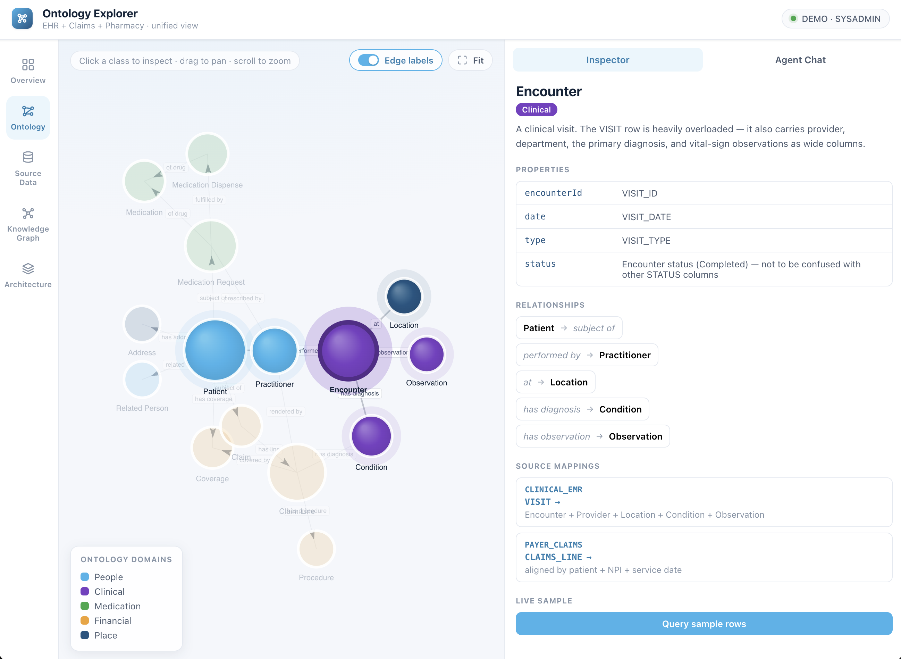
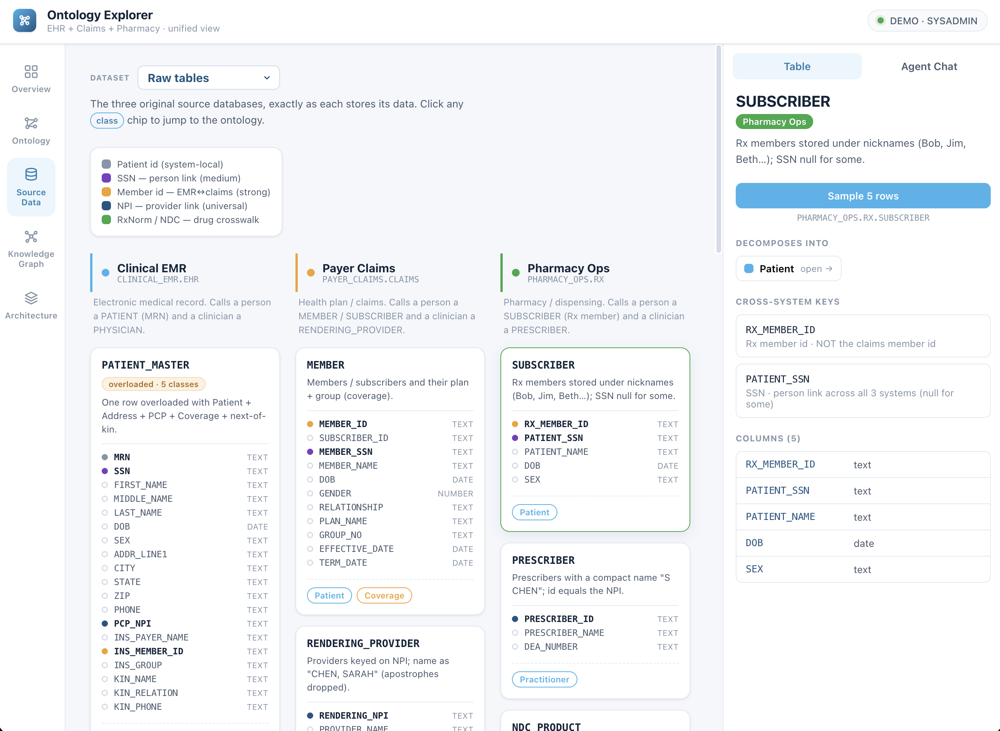
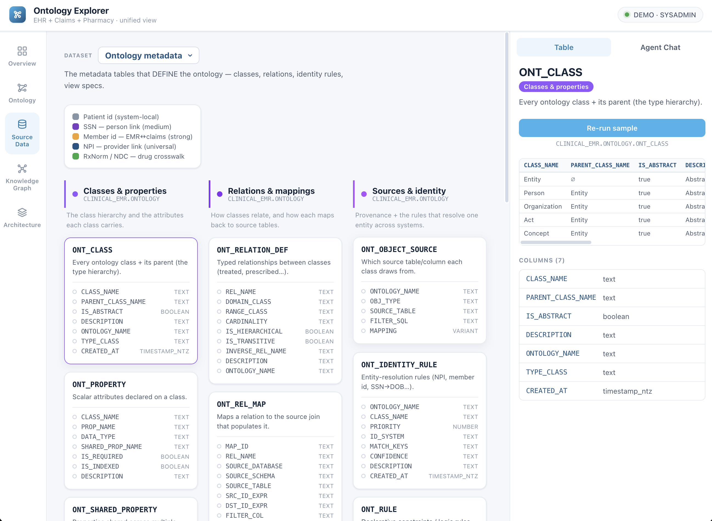
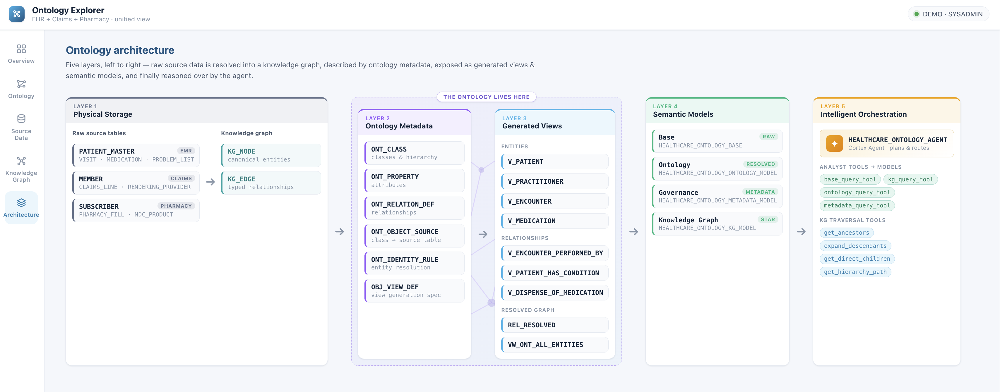

# Snowflake Ontology Explorer

Deploy an **Ontology-on-Snowflake knowledge graph** into your own account, then **visualize and explore it** in a local web app. The repo ships everything you need end to end: synthetic (deliberately messy) healthcare data across three source systems, the SQL that builds a full ontology layer on top of it, and a React + Express app that renders the ontology as a graph and lets you chat with a Cortex Agent over it.



> **Internal Snowflake enablement asset** — synthetic data only, not for external distribution. To re-skin it for another industry, see [ADAPTING.md](ADAPTING.md).

## What this is / when to use it

Use this repo to:
- **Explain and demo ontologies to customers** — show, on real messy data, why a naive `table = class` mapping fails and how an ontology resolves the same entity across systems.
- **Stand up a working ontology + Cortex Agent fast** — one command builds the graph, semantic views, and agents.
- **Explore an ontology visually** — the web app renders the class graph, the resolved instance graph, and each class's cross-system source mappings.
- **Adapt it to your own vertical** — the healthcare data is just a worked example; see [ADAPTING.md](ADAPTING.md).

## Prerequisites

- A Snowflake account in a **Cortex-enabled region** (the semantic views + agent use Cortex Analyst).
- A role that can `CREATE DATABASE` (e.g. `SYSADMIN`) and a warehouse (e.g. `COMPUTE_WH`).
- **Snowflake CLI** (`snow`) with a connection in `~/.snowflake/connections.toml`. Check what you have with `snow connection list`. The deploy defaults to a connection named `DEMO` — if yours is named something else (it usually is), point `SNOWFLAKE_CONNECTION` at it in `config.env` (see below).
- For the web app only: **Node 18+** and a **key-pair** connection (the browser cannot sign JWTs).

## Deploy the data + ontology

> **Using Cortex Code?** Just open this repo in CoCo and ask it to deploy — the root [`COCO.md`](COCO.md) tells it the connection-first deploy flow, subcommands, and guardrails. The manual steps below are the same thing by hand.

```bash
# Copy the config and set SNOWFLAKE_CONNECTION to your connection (db names are optional).
cp config.env.example config.env      # then edit — at minimum, set SNOWFLAKE_CONNECTION

./deploy.sh                 # load data -> build ontology -> verify, via `snow`
./deploy.sh render          # only render SQL into ./build (to paste into a worksheet)
./deploy.sh verify          # run the count assertions against your deployment
./deploy.sh teardown        # DROP the demo databases (asks to confirm)
./deploy.sh check           # prove render-with-defaults == source (no account needed)
```

`./deploy.sh` loads the three source systems ([`sql/data/`](sql/data/)) and then builds the ontology stack ([`sql/ontology/`](sql/ontology/)). Everything is parameterized through `config.env` — no code edits needed to rename:

| Variable | Default | Names |
|----------|---------|-------|
| `SNOWFLAKE_CONNECTION` | `DEMO` | which `connections.toml` entry to deploy with — **set this to your own connection name** |
| `BUILD_ROLE` / `WAREHOUSE` | `SYSADMIN` / `COMPUTE_WH` | role + warehouse for the build |
| `EMR_DB` / `EMR_SCHEMA` | `CLINICAL_EMR` / `EHR` | clinical EMR source |
| `CLAIMS_DB` / `CLAIMS_SCHEMA` | `PAYER_CLAIMS` / `CLAIMS` | payer claims source |
| `RX_DB` / `RX_SCHEMA` | `PHARMACY_OPS` / `RX` | pharmacy source |
| `ONTOLOGY_DB` / `ONTOLOGY_SCHEMA` | `=EMR_DB` / `ONTOLOGY` | where the ontology is built |

The database-name defaults reproduce the reference build exactly, so the only value most people need to change is `SNOWFLAKE_CONNECTION`. The web app reads the same names (via `server/.env`).

## Explore it in the web app

[`ontology-explorer/`](ontology-explorer/) is a local React + Express app that:
- **visualizes the ontology as a network graph** (both the class model and the resolved instance graph),
- **inspects each class's cross-system source mappings** with live sample rows, and
- **chats with a Cortex Agent** over the ontology (with a baseline agent to compare against).





```bash
cd ontology-explorer
npm install && npm run install:all
npm run dev                 # backend :3001 + frontend :5173 -> open http://localhost:5173
```

It authenticates with the connection from `~/.snowflake/connections.toml` (defaults to `DEMO`, override with `SNOWFLAKE_CONNECTION_NAME`). To wire chat to the agent you deployed, set `CORTEX_AGENT_NAME`. See the [app README](ontology-explorer/README.md) for full configuration.

## Why an ontology? (the payoff)

Once the data is aligned, the ontology exposes one connected graph you can traverse:

```
Patient ──has coverage──> Coverage (Plan)
   │
   ├── subject of ──> Encounter ──performed by──> Practitioner ──at──> Location
   │                     └── has ──> Condition (diagnosis)
   │                     └── has ──> Observation (vitals / labs)
   │
   ├── subject of ──> Claim / ClaimLine ──> Procedure + Diagnosis + Coverage
   │
   └── subject of ──> MedicationRequest ──> MedicationDispense ──> Medication
                          (prescribed by Practitioner)
```

**The "killer" demo question:** *"How many distinct patients did Dr. Chen treat, and what were they prescribed?"*
- **Naive SQL fails:** `PHYSICIAN` ≠ `RENDERING_PROVIDER` ≠ `PRESCRIBER`; `PATIENT` ≠ `MEMBER` ≠ `SUBSCRIBER`; EMR drug names ≠ pharmacy brand names.
- **With the ontology:** `Practitioner` (NPI `1003000001`) resolves all three name forms; `Patient` is de-duplicated across systems; `Medication` is normalized via the RxNorm↔NDC crosswalk — including the NULL-RxNorm cases. → **9 patients.**

The data ships with family/coverage cases for relationship demos: `SUBFAM1` (James Johnson self + Linda Williams spouse), `SUBFAM2` (MBR0013 + MBR0014 spouse), `SUBFAM3` (MBR0027 + MBR0028 child).

Why this is hard — and how the ontology earns its keep — comes from the source data's deliberate messiness. See **[`sql/data/README.md`](sql/data/README.md)** for the eight alignment challenges (overloaded tables, name divergence, imperfect keys, code crosswalks, and more).

## What you deploy (at a glance)

`./deploy.sh` builds, in `<ONTOLOGY_DB>.<ONTOLOGY_SCHEMA>` (default `CLINICAL_EMR.ONTOLOGY`), a full *Ontology-on-Snowflake* Knowledge-Graph stack:

- A **physical KG** (`KG_NODE` / `KG_EDGE`) with cross-system entity resolution.
- **22 ontology classes** and **33 relationships** (including 4 edges the raw schema has no foreign key for).
- **4 Cortex Analyst semantic views** (base, KG, ontology, metadata).
- **2 Cortex Agents** — the full ontology agent (8 intent-routed tools) and a deliberately limited **baseline** agent, so you can show the contrast.



**The payoff, measured:** ask both agents *"how many metformin-dispensed patients are also diabetic?"* The baseline bridges on SSN only and returns **7** (silently dropping the 2 NULL-SSN patients); the ontology agent applies the SSN → name+DOB fallback and returns the correct **9**. A semantic view can only join on keys that already exist; the ontology bakes the *degrading-hierarchy resolution* into a governed, deterministic layer.

For the full class model, relationship catalog, layer inventory, agent tools, and a business-question + query cookbook, see **[`sql/ontology/README.md`](sql/ontology/README.md)**.

## Repo layout

```
snowflake-ontology-explorer/
├── README.md                 # this file — purpose, deploy, run
├── ADAPTING.md               # how to re-skin this demo for another vertical
├── config.env.example        # deploy config (copy to config.env to rename databases)
├── deploy.sh                 # one-command render + deploy + verify + teardown
├── scripts/
│   └── render.pl             # parameterization engine (default names <-> config.env)
├── sql/
│   ├── data/                 # the three messy source systems + their README
│   │   ├── 01_clinical_emr.sql   # CLINICAL_EMR.EHR   — PATIENT_MASTER, PHYSICIAN, DEPARTMENT, …
│   │   ├── 02_payer_claims.sql   # PAYER_CLAIMS.CLAIMS — MEMBER, RENDERING_PROVIDER, CLAIMS_LINE, …
│   │   ├── 03_pharmacy_ops.sql   # PHARMACY_OPS.RX     — SUBSCRIBER, PRESCRIBER, NDC_PRODUCT, …
│   │   └── README.md             # what the data is + the 8 alignment challenges
│   └── ontology/             # the ontology stack, one SQL file per build phase
│       ├── 01_phase4_layers_1-3.sql                     # KG + resolution, metadata, views, SPs, UDFs
│       ├── 02_phase4.5_base_semantic_view.sql           # base semantic view
│       ├── 03_phase5_ontology_layer_semantic_views.sql  # KG / Ontology / Metadata semantic views
│       ├── 04_phase6_cortex_agents.sql                  # ontology agent + baseline agent
│       ├── verify.sql                                   # post-deploy count assertions
│       ├── teardown.sql                                 # drop the demo databases
│       └── README.md                                    # full ontology reference
└── ontology-explorer/        # local React + Express app: graph viz, class inspector, agent chat
```

**Run order:** `./deploy.sh` handles it. Manually: `sql/data/01 → 02 → 03` → `sql/ontology/01 → 02 → 03 → 04`, all as a `CREATE DATABASE`-capable role.
